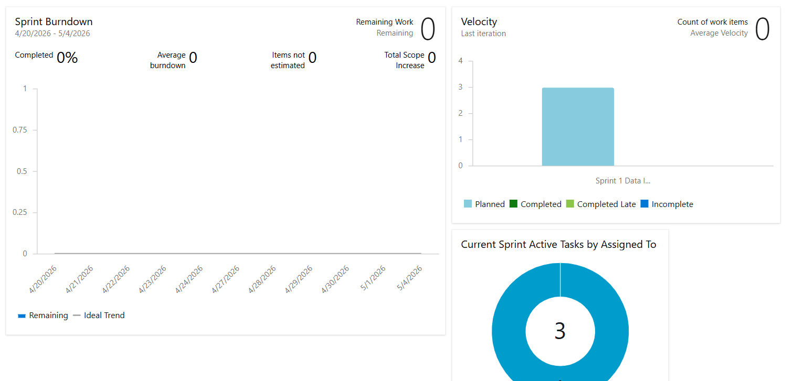
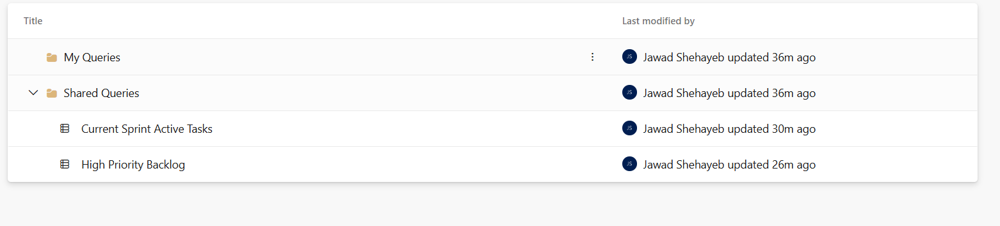
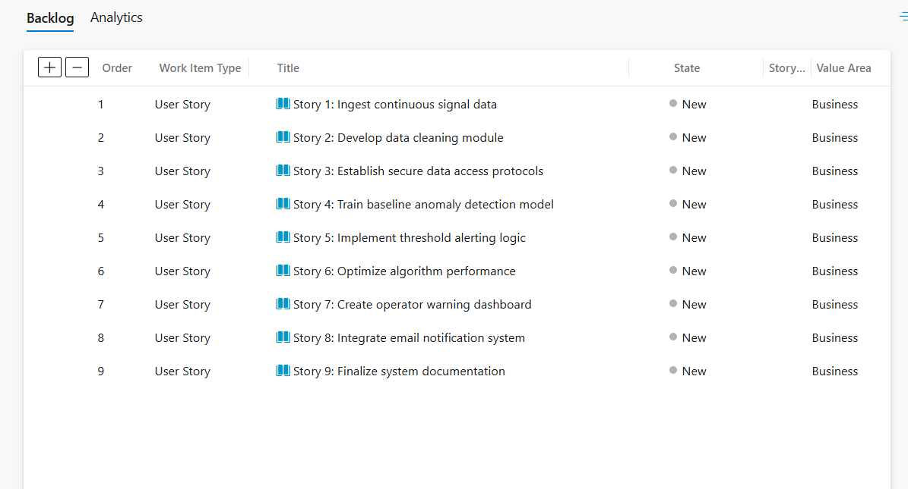

# Abidjan.ai Project Management Internship Assignment

## Project Overview
This repository contains the documentation and project management artifacts for a simulated **Predictive Maintenance Machine Learning System**. The project focuses on ingesting continuous signal data from industrial DC motors, processing the data, and training a ML model to detect anomalies and predict mechanical failures before they occur. 

## Project Structure
The project was structured using the Agile Scrum framework within Microsoft Azure DevOps, broken down into three 2-week sprints:
* **Sprint 1 (Infrastructure):** Continuous signal data ingestion, cleaning modules, and secure access protocols.
* **Sprint 2 (Machine Learning):** Baseline model training on healthy transient/steady-state behaviors and threshold alerting logic.
* **Sprint 3 (Deployment):** Operator warning dashboards and email notification systems.

## Key Learnings
1. **Agile Methodology:** Gained hands-on experience structuring a project into logical sprints and managing dependencies between data engineering and ML teams.
2. **INVEST Model:** Learned how to write clear, actionable user stories with precise acceptance criteria.
3. **Azure DevOps:** Mastered the creation of custom queries to track high-priority work and utilized dashboards to monitor sprint burndown and team velocity.

## Azure DevOps Visual Proof
Below are the screenshots demonstrating the setup of the Azure DevOps environment:

### Sprint Dashboard

### Custom Queries

### Product Backlog

